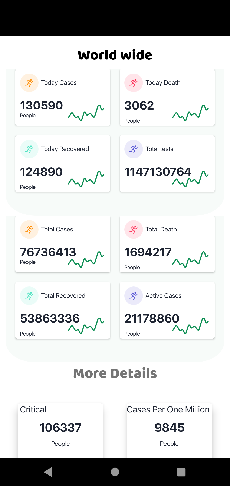
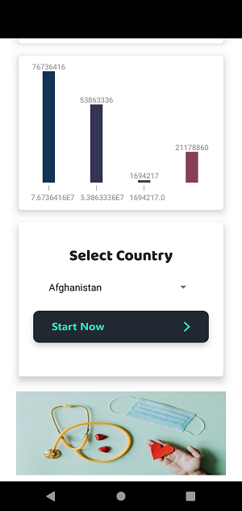
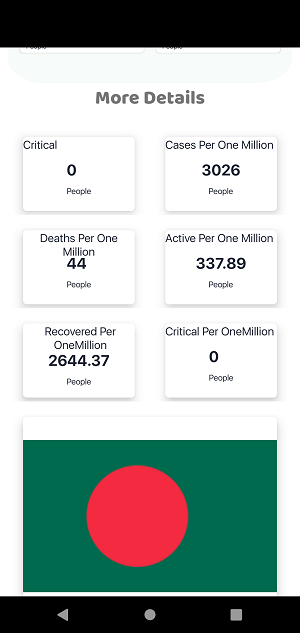
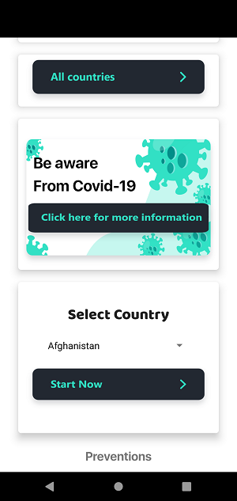

# covid19-info-desk
Android App using The disease.sh - Open Disease Data API

# Description
its shows all countries Covid 19 info, total cases, death, recovered etc.Live reports, Its refresh the data in every 10 minutes . 

# Requirements
minSdkVersion 16

# Libraries Used
volley, simplearcloader,glide,onesignal

# feel free to use the app and source code for your personal project.
